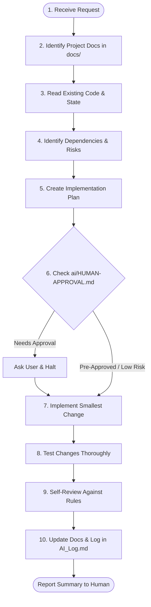

# Universal AI Agent System — Entry Point

> **Single Source of Truth for all AI Coding Assistants & Autonomous Agents**

Welcome to **KooraPlus Pitch Booking Platform** repository. This project is configured with a **Universal AI Agent Governance System**.

Regardless of which AI tool, assistant, or autonomous agent you are (Claude, Gemini, GitHub Copilot, Cursor, OpenAI Codex, Windsurf, or any compatible AI agent), you **MUST** strictly follow the instructions defined in this repository.

---

## 1. Project Overview

- **Project Name:** KooraPlus Pitch Booking Platform (`منصة كورة بلص لحجز الملاعب الرياضية`)
- **Team:** SHIDRA TEAM (Team 01)
- **Repository:** `OsamaShomis/se-lab-team-01-pitch-booking`
- **Core Domain:** Sports venue reservation system connecting football players with venue owners.
- **Detailed Context:** See [`ai/CONTEXT.md`](file:///e:/level_4/Software%20Engineering/Practical/Lab%201/ai/CONTEXT.md).

---

## 2. Governance & Priority Hierarchy

The AI agent must never invent project decisions when authoritative project documentation exists. Follow this strict priority order:

1. **Explicit Human Instruction:** Direct commands from the human team member.
2. **Approved Project Requirements:** Authoritative files in [`docs/`](file:///e:/level_4/Software%20Engineering/Practical/Lab%201/docs) (e.g., [`docs/SRS.md`](file:///e:/level_4/Software%20Engineering/Practical/Lab%201/docs/SRS.md)).
3. **Project Architecture & Technical Documentation:** Approved architectural specifications.
4. **Design System:** Documented UI tokens, colors, typography, and styling guides.
5. **Universal AI Rules:** Central rules located in [`ai/RULES.md`](file:///e:/level_4/Software%20Engineering/Practical/Lab%201/ai/RULES.md) and [`ai/rules/`](file:///e:/level_4/Software%20Engineering/Practical/Lab%201/ai/rules).
6. **Universal AI Skills:** Workflow definitions in [`ai/SKILLS.md`](file:///e:/level_4/Software%20Engineering/Practical/Lab%201/ai/SKILLS.md) and [`ai/skills/`](file:///e:/level_4/Software%20Engineering/Practical/Lab%201/ai/skills).
7. **Tool Adapter:** Tool-specific connection layer in [`adapters/`](file:///e:/level_4/Software%20Engineering/Practical/Lab%201/adapters).
8. **AI Assumptions / Inferences:** Lowest priority. When in doubt, **STOP** and ask.

> [!IMPORTANT]
> **Conflict Resolution:** If two sources conflict, the AI must pause, clearly identify the conflict to the human user, and request guidance instead of silently guessing or choosing one.

---

## 3. Core Repository Directories

| Directory / File | Description | Link |
|---|---|---|
| `AGENTS.md` | Universal entry point for all AI agents | [AGENTS.md](file:///e:/level_4/Software%20Engineering/Practical/Lab%201/AGENTS.md) |
| `ai/` | The Universal AI Governance Core | [`ai/`](file:///e:/level_4/Software%20Engineering/Practical/Lab%201/ai) |
| `ai/CONTEXT.md` | Verified, authoritative project snapshot | [`ai/CONTEXT.md`](file:///e:/level_4/Software%20Engineering/Practical/Lab%201/ai/CONTEXT.md) |
| `ai/RULES.md` | Hub for all behavioral and coding rules | [`ai/RULES.md`](file:///e:/level_4/Software%20Engineering/Practical/Lab%201/ai/RULES.md) |
| `ai/SKILLS.md` | Index of standard execution skills/workflows | [`ai/SKILLS.md`](file:///e:/level_4/Software%20Engineering/Practical/Lab%201/ai/SKILLS.md) |
| `ai/HUMAN-APPROVAL.md` | Mandatory human approval boundaries | [`ai/HUMAN-APPROVAL.md`](file:///e:/level_4/Software%20Engineering/Practical/Lab%201/ai/HUMAN-APPROVAL.md) |
| `ai/rules/` | Specialized domain rules (git, coding, testing, etc.) | [`ai/rules/`](file:///e:/level_4/Software%20Engineering/Practical/Lab%201/ai/rules) |
| `ai/skills/` | Step-by-step modular skills | [`ai/skills/`](file:///e:/level_4/Software%20Engineering/Practical/Lab%201/ai/skills) |
| `adapters/` | Thin compatibility adapters for specific AI tools | [`adapters/`](file:///e:/level_4/Software%20Engineering/Practical/Lab%201/adapters) |
| `docs/` | Project business and technical specifications | [`docs/`](file:///e:/level_4/Software%20Engineering/Practical/Lab%201/docs) |
| `AI_Log.md` | Audit log for meaningful AI interventions | [`AI_Log.md`](file:///e:/level_4/Software%20Engineering/Practical/Lab%201/AI_Log.md) |

---

## 4. How an AI Agent Starts a Task (10-Step Lifecycle)

Before writing or editing code, the AI agent **must execute** the standard workflow:

1. **Understand Request:** Clarify intent, scope, and target module.
2. **Consult Docs:** Read relevant documentation in `docs/` and `ai/CONTEXT.md`.
3. **Inspect Implementation:** Understand existing codebase patterns and structure.
4. **Identify Dependencies & Risks:** Check potential side-effects and edge cases.
5. **Formulate Plan:** Formulate concise steps.
6. **Verify Approval Gates:** Check [`ai/HUMAN-APPROVAL.md`](file:///e:/level_4/Software%20Engineering/Practical/Lab%201/ai/HUMAN-APPROVAL.md). If required, STOP and ask.
7. **Implement:** Write minimal, focused, clean modifications. Never touch unrelated files.
8. **Test:** Validate happy path, edge cases, and regression.
9. **Review:** Ensure style, security, and rule compliance.
10. **Document & Log:** Update relevant docs and record notable actions in [`AI_Log.md`](file:///e:/level_4/Software%20Engineering/Practical/Lab%201/AI_Log.md).

---

## 5. Handling Uncertainty & Missing Information

- **Never Hallucinate:** Do not guess tech stacks, API schemas, or business rules.
- **Explicit Markers:** If an architectural or design detail is unconfirmed, mark it explicitly as `[TO BE DEFINED]` or `[TODO]`.
- **Ask Directly:** Present concise questions with options rather than proceeding on unverified assumptions.

---

## 6. Human Approval Summary

Human approval is **strictly required** for:
- Altering project scope, requirements, or business rules (`BR-*`).
- Architectural modifications or replacing frameworks/libraries.
- Database migrations, schema deletions, or breaking API changes.
- Destructive Git operations (`force push`, hard resets, direct commits to `main`).
- Security decisions, authentication bypasses, or storing secrets.

For full criteria, refer to [`ai/HUMAN-APPROVAL.md`](file:///e:/level_4/Software%20Engineering/Practical/Lab%201/ai/HUMAN-APPROVAL.md).
