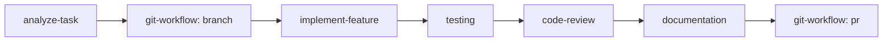

# Universal AI Skills Index (`ai/SKILLS.md`)

> **Catalog of Standard Operating Procedures & Execution Workflows for AI Agents**

Skills are structured, repeatable workflows designed to ensure high quality, deterministic outcomes, and consistent engineering standards across all AI interactions.

---

## 1. Skill Execution Model

Each skill document in [`ai/skills/`](file:///e:/level_4/Software%20Engineering/Practical/Lab%201/ai/skills) contains a strict, standardized contract:
- **Purpose:** The objective of the skill.
- **When to Use:** Preconditions and scenarios for triggering.
- **Required Inputs:** Documentation, files, or parameters necessary to begin.
- **Steps:** Exact, sequential procedure to follow.
- **Rules:** Specific constraints during execution.
- **Validation:** Criteria to verify successful completion.
- **Expected Output:** Concrete deliverables produced.
- **Human Approval Requirements:** Trigger points requiring human sign-off before proceeding.

---

## 2. Directory of Available Skills

| Skill | Purpose | When to Use | Link |
|---|---|---|---|
| **Analyze Task** | Deconstruct user request, identify risks, check docs, and plan steps | Starting any non-trivial user prompt or feature request | [`analyze-task`](file:///e:/level_4/Software%20Engineering/Practical/Lab%201/ai/skills/analyze-task/SKILL.md) |
| **Implement Feature** | Build a new feature cleanly adhering to architecture and specs | When assigned an approved user story or FR requirement | [`implement-feature`](file:///e:/level_4/Software%20Engineering/Practical/Lab%201/ai/skills/implement-feature/SKILL.md) |
| **Fix Bug** | Identify root cause, write reproducing test, apply fix, prevent regression | When diagnosing, reproducing, and repairing an issue | [`fix-bug`](file:///e:/level_4/Software%20Engineering/Practical/Lab%201/ai/skills/fix-bug/SKILL.md) |
| **UI Development** | Build or refine user interfaces with high visual fidelity & accessibility | Implementing frontend screens, components, or styles | [`ui-development`](file:///e:/level_4/Software%20Engineering/Practical/Lab%201/ai/skills/ui-development/SKILL.md) |
| **Testing** | Design and execute unit, integration, edge-case, and regression tests | Validating bug fixes, feature completeness, or test suites | [`testing`](file:///e:/level_4/Software%20Engineering/Practical/Lab%201/ai/skills/testing/SKILL.md) |
| **Code Review** | Perform systematic static analysis, rule verification, and security checks | Reviewing a Pull Request or inspecting code before merge | [`code-review`](file:///e:/level_4/Software%20Engineering/Practical/Lab%201/ai/skills/code-review/SKILL.md) |
| **Documentation** | Create or synchronize project documentation without hallucinations | Documenting architectures, APIs, guides, or decisions | [`documentation`](file:///e:/level_4/Software%20Engineering/Practical/Lab%201/ai/skills/documentation/SKILL.md) |
| **Git Workflow** | Guide branch creation, commit hygiene, PR submission, and merge flow | Preparing, pushing, and managing git branches and PRs | [`git-workflow`](file:///e:/level_4/Software%20Engineering/Practical/Lab%201/ai/skills/git-workflow/SKILL.md) |

---

## 3. Skill Composition & Orchestration

Skills can be combined into composite workflows. For example, implementing an end-to-end feature follows this lifecycle:

