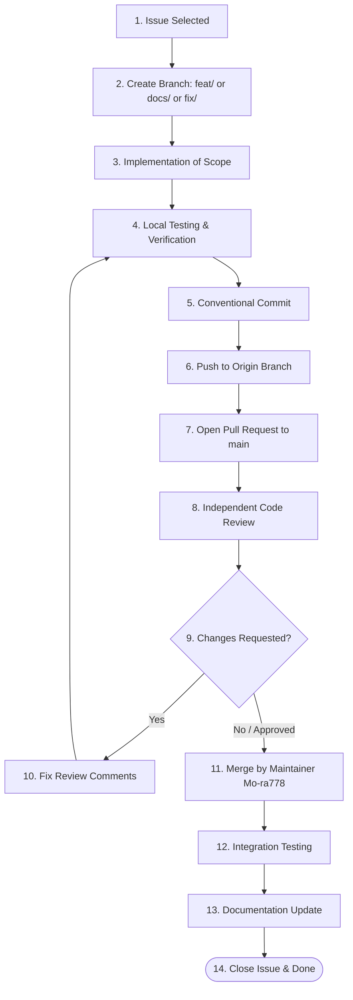

# Skill: Git Workflow (`ai/skills/git-workflow/SKILL.md`)

## Purpose
Execute and guide the full team Git version control lifecycle from initial issue pickup through branch creation, commits, PR review, maintainer merge, and documentation closure.

## When to Use
- Whenever beginning work on a new feature, bug fix, or documentation task, and when preparing code for review and integration.

## Required Inputs
- Target Issue ID and description.
- Assigned developer name according to [`docs/WORK_DISTRIBUTION.md`](file:///e:/level_4/Software%20Engineering/Practical/Lab%201/docs/WORK_DISTRIBUTION.md).
- Clean local working tree.

## Complete 14-Step Lifecycle

## Detailed Execution Steps
1. **Issue:** Verify the issue exists and is assigned to the current team member.
2. **Branch:** Fetch latest `main` (`git pull origin main`) and branch out: `git checkout -b <type>/<description>`.
3. **Implementation:** Write clean, focused code satisfying the issue.
4. **Local Testing:** Run unit/feature tests; ensure zero breakages.
5. **Commit:** Stage relevant files (`git add <files>`) and commit using conventional syntax (`feat:`, `fix:`, `docs:`, etc.).
6. **Push:** Push branch to remote (`git push origin <branch-name>`).
7. **Pull Request:** Open PR targeting `main` with detailed description and Issue link.
8. **Code Review:** Assigned reviewer reviews according to [`ai/skills/code-review/SKILL.md`](file:///e:/level_4/Software%20Engineering/Practical/Lab%201/ai/skills/code-review/SKILL.md).
9. **Fix Comments:** Developer resolves all review feedback on the branch.
10. **Merge:** Maintainer (`Mo-ra778`) merges the PR into `main`.
11. **Integration Testing:** Post-merge sanity checks on `main`.
12. **Documentation Update:** Record final changes in `AI_Log.md` or system docs.

## Rules
- Never commit directly to `main`.
- Never merge a PR without peer approval.
- Avoid destructive commands (`--force`, `reset --hard`) unless human approval is explicitly granted.

## Validation
- Branch adheres to naming standards.
- Commits are atomic and use conventional format.
- PR is reviewed by the designated peer reviewer before merge.

## Expected Output
- Clean Git branch, conventional commits, submitted PR, and closed issue.

## Human Approval Requirements
- Required for merging any PR into `main`.
- Required for any force push or branch deletion.
