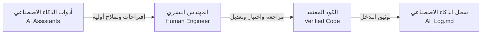

# دليل وإرشادات استخدام الذكاء الاصطناعي (AI Usage Guidelines)
## منصة كورة بلص لحجز الملاعب الرياضية — KooraPlus
### فريق شيدرا — SHIDRA TEAM (Team 01)

---

## 1. بطاقة الوثيقة

| الحقل | القيمة |
|---|---|
| **اسم المشروع** | منصة كورة بلص لحجز الملاعب الرياضية (KooraPlus) |
| **المسؤول المعتمد** | أسامة العقاب (`osalokab` — Quality Reviewer & Developer) |
| **المراجع المعتمد** | أسامة الشميس (`OsamaShomis` — Team Coordinator) |
| **الإصدار** | 1.0 (معتمد للنسخة الأولى) |
| **تاريخ التحديث** | 2026-09-26 |
| **المرجع** | [`docs/WORK_DISTRIBUTION.md`](file:///d:/my_projects/koora+/docs/WORK_DISTRIBUTION.md) (الخطوة 16) و [`ai/RULES.md`](file:///d:/my_projects/koora+/ai/RULES.md) |

---

## 2. فلسفة وسياسة استخدام الذكاء الاصطناعي (AI Policy)

يعتمد فريق العمل سياسة **"المساعد الذكي مع التحكم البشري الكامل" (Human-in-the-Loop)**. يهدف استخدام الذكاء الاصطناعي إلى تسريع التطوير، وتحسين جودة الكود، واكتشاف حالات الحافة، دون المساس بملكية الفريق للمشروع أو فهمه الدقيق لكل سطر برمجي وتوثيقي.

---

## 3. العمليات المسموحة والمحظورة (Approved vs Prohibited Usage)

### 🟢 العمليات المسموحة والمشجعة (Approved AI Tasks)
1. **المساعدة في صياغة المتطلبات:** تنظيم وهيكلة وثائق الـ Mini-SRS والـ User Stories.
2. **اقتراح وتغطية حالات الحافة (Edge Cases Discovery):** تحليل متطلبات الأعمال واقتراح سيناريوهات الفشل والتزامن.
3. **توليد الاختبارات الآلية (Test Generation):** إنشاء هياكل اختبارات الوحدات والتكامل (Pest / PHPUnit).
4. **شرح وتدقيق الكود (Code Explanation & Refactoring):** مراجعة الأكواد لتحسين الأداء والأمان وتطبيق مبادئ Clean Code.
5. **إنشاء المخططات التوضيحية (Mermaid Diagrams):** رسم تدفقات المستخدم وهندسة النظام.

### 🔴 العمليات المحظورة قطيعاً (Prohibited Actions)
1. **الدمج التلقائي في فرع `main`:** يُمنع دمج أي كود دون مراجعة بشرية واختبارات ناجحة.
2. **اتخاذ قرارات معمارية منفردة:** لا يجوز للذكاء الاصطناعي تغيير التقنيات (مثل استبدال قاعدة البيانات أو إطار العمل) دون موافقة الفريق.
3. **توليد كود غير مفهوم:** يُمنع اعتماد أي كود مولد دون فهم المهندس لكيفية عمله وقدرته على شرحه.
4. **تجاوز حدود المهام (Cross-Boundary Changes):** لا يجوز تعديل ميزات يملكها عضو آخر في الفريق دون تفويض صريح.

---

## 4. معايير هندسة الأوامر (Prompt Engineering Standards)

للحصول على أعلى جودة من أدوات الذكاء الاصطناعي (Claude, Gemini, ChatGPT, Copilot)، يجب اتباع المعايير التالية في صياغة المطالبات:

1. **تحديد السياق والدور (Role & Context):**
   *مثال:* *"بصفتك مهندس برمجيات أول متخصص في Laravel 11، قم بمراجعة هذا الموديل..."*
2. **ربط الطلب بمتطلبات المشروع وقواعد العمل:**
   *مثال:* *"اكتب دالة التحقق من شرط الإلغاء مع مراعاة قاعدة العمل `BR-03` الموثقة في `docs/SRS.md`."*
3. **طلب اختبارات محددة وحالات حافة:**
   *مثال:* *"وفر مع هذا الكود اختبار Feature يغطي حالة حجز متزامن لـ 2 مستخدمين في نفس اللحظة."*
4. **تحديد التنسيق ولغة الإخراج:**
   *مثال:* *"استخدم Mermaid لرسم المخطط مع كتابة التوضيحات باللغة العربية."*

---

## 5. ميثاق التحقق وضمان الجودة (Verification Protocol)

قبل قبول أي مخرج مولد بالذكاء الاصطناعي:
1. **الفحص البصري والمنطقي (Code Inspection):** قراءة الكود سطراً بسطر للتأكد من عدم وجود ثغرات أمنية (SQL Injection, XSS, IDOR).
2. **التشغيل والتنفيذ الفعلي (Local Execution):** تجربة الكود محلياً وتشغيل `php artisan test`.
3. **الالتزام بـ Definition of Done:** التأكد من مطابقة الكود لمعايير التوثيق وتسمية المتغيرات.
4. **التوثيق الفوري:** تسجيل التدخل المؤثر في [`AI_Log.md`](file:///d:/my_projects/koora+/AI_Log.md).

---

## 6. نموذج توثيق الذكاء الاصطناعي المعتمد (Log Template)

يجب توثيق كل تدخل رئيسي في [`AI_Log.md`](file:///d:/my_projects/koora+/AI_Log.md) باستخدام البنود التالية:
- **التاريخ واسم المهندس المسؤول.**
- **الأداة المستخدمة (Gemini / Claude / Copilot).**
- **المهمة والهدف من الاستعانة بالأداة.**
- **الملفات المتأثرة.**
- **الاقتراحات المقبولة والمرفوضة مع تبرير الرفض.**
- **القرارات البشرية المستقلة وطريقة الاختبار والتحقق.**
