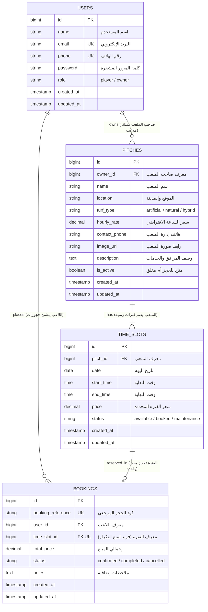

# Database Design — تصميم ومخطط قاعدة البيانات

## منصة كورة بلص (KooraPlus Pitch Booking Platform)

| الحقل                   | القيمة                                                               |
| ----------------------- | -------------------------------------------------------------------- |
| **اسم المشروع**         | KooraPlus Pitch Booking Platform                                     |
| **الفريق**              | SHIDRA TEAM (Team 01)                                                |
| **المسؤول**             | محمد الإدريسي (`Mo-ra778` — Repository Maintainer & Developer)       |
| **محرك قاعدة البيانات** | **SQLite 3.x** (ملف: `database/database.sqlite`)                     |
| **الحالة**              | معتمد ومكتمل ✅                                                       |
| **الإصدار**             | 1.0                                                                  |
| **آخر تحديث**           | 2026-09-26                                                           |
| **الخطوة المرتبطة**     | الخطوة رقم 9 في[`docs/WORK_DISTRIBUTION.md`](./WORK_DISTRIBUTION.md) |

---

## 1. 🎯 نظرة عامة والقرارات المعمارية (Database Overview)

قاعدة بيانات منصة **KooraPlus** مصممة لتكون **بسيطة، سريعة، وعالية الموثوقية** لتلبية متطلبات النظام الأساسية (المتطلبات الوظيفية FR-01 إلى FR-06).

### القرارات المعمارية المعتمدة:

1. **المحرك (Engine):** **SQLite 3.x** مدمج عبر امتداد `pdo_sqlite` في PHP.
   - لا حاجة لتثبيت خوادم قواعد بيانات خارجية (مثل MySQL أو MariaDB).
   - ملف قاعدة بيانات موحد (`database/database.sqlite`) يسهل تشغيله وتناقله بين أعضاء الفريق دون أي تضارب.
2. **الترميز ومحارف اللغة (Encoding):** `UTF-8` كامل لضمان دعم وتخزين النصوص العربية وأسماء الملاعب واللاعبين بسلاسة.
3. **سلامة المفاتيح الأجنبية (Foreign Keys):** تفعيل قيد المفاتيح الأجنبية إجبارياً في SQLite عبر تشغيل:
   ```sql

   PRAGMA foreign_keys = ON;
   ```
4. **تكامل البيانات ومنع التضارب (ACID Transactions):**
   - حماية عمليات الحجز من الحجز المزدوج (Race Conditions) عبر قيد فريد `UNIQUE(time_slot_id)` في جدول الحجوزات ومعاملات `DB::transaction()`.

---

## 2. 📊 مخطط الكيانات والعلاقات (Entity-Relationship Diagram - ERD)



### توصيف العلاقات بين الكيانات (Cardinality & Multiplicity):

- **المستخدم والملاعب (`users` 1 ──< N `pitches`):** مستخدم واحد من نوع `owner` يمكن أن يمتلك ملعباً واحداً أو أكثر.
- **الملعب والفترات الزمنية (`pitches` 1 ──< N `time_slots`):** كل ملعب يتفرع عنه جدول من الساعات والفترات اليومية.
- **المستخدم والحجوزات (`users` 1 ──< N `bookings`):** كل لاعب يمكن أن يجري حجوزات متعددة على مدار فترات زمنية مختلفة.
- **الفترة الزمنية والحجز (`time_slots` 1 ── 0..1 `bookings`):** الفترة الزمنية إما ألا تكون محجوزة بعد (0)، أو ترتبط بحجز واحد مؤكد فقط (1). ويتم فرض هذا هندسياً عبر قيد `UNIQUE(time_slot_id)` في جدول الحجوزات.

---

## 3. 🗄️ قاموس البيانات وهيكل الجداول (Data Dictionary)

### أ. جدول المستخدمين (`users`)

يخدم تسجيل الحسابات والمصادقة وإدارة الصلاحيات (المتطلب **FR-01**).

| اسم الحقل        | النوع           | Nullable | الافتراضي      | المفتاح والقيود                      | الوصف والدور                             |
| ---------------- | --------------- | :------: | -------------- | ------------------------------------ | ---------------------------------------- |
| `id`             | BIGINT UNSIGNED |    ❌     | Auto Increment | **PK**                               | المعرف الرقمي الأساسي للمستخدم           |
| `name`           | VARCHAR(100)    |    ❌     | —              | —                                    | الاسم الكامل للمستخدم                    |
| `email`          | VARCHAR(150)    |    ❌     | —              | **UNIQUE**                           | البريد الإلكتروني (لتسجيل الدخول)        |
| `phone`          | VARCHAR(20)     |    ❌     | —              | **UNIQUE**                           | رقم الهاتف (للتواصل وتأكيد الحجز)        |
| `password`       | VARCHAR(255)    |    ❌     | —              | —                                    | كلمة المرور مشفرة بـ Bcrypt (حسب NFR-02) |
| `role`           | VARCHAR(20)     |    ❌     | `'player'`     | `CHECK(role IN ('player', 'owner'))` | دور المستخدم: لاعب أو صاحب ملعب          |
| `remember_token` | VARCHAR(100)    |    ✅     | NULL           | —                                    | رمز تذكر تسجيل الدخول (خاص بـ Laravel)   |
| `created_at`     | TIMESTAMP       |    ✅     | NULL           | —                                    | تاريخ إنشاء الحساب                       |
| `updated_at`     | TIMESTAMP       |    ✅     | NULL           | —                                    | تاريخ آخر تعديل للحساب                   |

**الفهارس (Indexes):**

- `PRIMARY KEY (id)`
- `UNIQUE INDEX idx_users_email (email)`
- `UNIQUE INDEX idx_users_phone (phone)`
- `INDEX idx_users_role (role)` (لتسريع تصفية المستخدمين حسب أدوارهم)

---

### ب. جدول الملاعب (`pitches`)

يخدم استعراض قائمة الملاعب، البحث عنها، وعرض مواصفاتها وأسعارها (المتطلب **FR-02**).

| اسم الحقل       | النوع           | Nullable | الافتراضي      | المفتاح والقيود                                           | الوصف والدور                                    |
| --------------- | --------------- | :------: | -------------- | --------------------------------------------------------- | ----------------------------------------------- |
| `id`            | BIGINT UNSIGNED |    ❌     | Auto Increment | **PK**                                                    | المعرف الرقمي للملعب                            |
| `owner_id`      | BIGINT UNSIGNED |    ❌     | —              | **FK** (`users.id`) ON DELETE CASCADE                     | صاحب ومسؤول الملعب                              |
| `name`          | VARCHAR(150)    |    ❌     | —              | —                                                         | اسم الملعب الرياضي                              |
| `location`      | VARCHAR(255)    |    ❌     | —              | —                                                         | العنوان والمدينة والحي                          |
| `turf_type`     | VARCHAR(30)     |    ❌     | `'artificial'` | `CHECK(turf_type IN ('artificial', 'natural', 'hybrid'))` | نوع الأرضية: عشب صناعي، طبيعي، أو هجين          |
| `hourly_rate`   | DECIMAL(8, 2)   |    ❌     | —              | —                                                         | السعر الأساسي لحجز الساعة الواحدة (بالريال)     |
| `contact_phone` | VARCHAR(20)     |    ❌     | —              | —                                                         | رقم هاتف إدارة الملعب للتواصل والاستفسار        |
| `image_url`     | VARCHAR(255)    |    ✅     | NULL           | —                                                         | رابط أو مسار الصورة الرئيسية للملعب             |
| `description`   | TEXT            |    ✅     | NULL           | —                                                         | تفاصيل المرافق (مواقف، كشافات، كرات، غرف تبديل) |
| `is_active`     | BOOLEAN         |    ❌     | `1` (True)     | —                                                         | حالة الملعب (متاح للحجوزات أم مغلق مؤقتاً)       |
| `created_at`    | TIMESTAMP       |    ✅     | NULL           | —                                                         | تاريخ إضافة الملعب                              |
| `updated_at`    | TIMESTAMP       |    ✅     | NULL           | —                                                         | تاريخ تحديث بيانات الملعب                       |

**الفهارس (Indexes):**

- `PRIMARY KEY (id)`
- `INDEX idx_pitches_owner (owner_id)`
- `INDEX idx_pitches_location (location)` (لتسريع تصفية الملاعب حسب المنطقة)
- `INDEX idx_pitches_active (is_active)`

---

### ج. جدول الفترات الزمنية (`time_slots`)

يخدم عرض الساعات اليومية المتاحة والمحجوزة لحظياً لكل ملعب (المتطلب **FR-03**).

| اسم الحقل    | النوع           | Nullable | الافتراضي      | المفتاح والقيود                                           | الوصف والدور                                      |
| ------------ | --------------- | :------: | -------------- | --------------------------------------------------------- | ------------------------------------------------- |
| `id`         | BIGINT UNSIGNED |    ❌     | Auto Increment | **PK**                                                    | المعرف الرقمي للفترة الزمنية                      |
| `pitch_id`   | BIGINT UNSIGNED |    ❌     | —              | **FK** (`pitches.id`) ON DELETE CASCADE                   | الملعب التابعة له هذه الفترة                      |
| `date`       | DATE            |    ❌     | —              | —                                                         | تاريخ اليوم الخاص بالفترة (YYYY-MM-DD)            |
| `start_time` | TIME            |    ❌     | —              | —                                                         | وقت بداية الفترة (مثلاً:`18:00:00`)                |
| `end_time`   | TIME            |    ❌     | —              | —                                                         | وقت نهاية الفترة (مثلاً:`19:00:00`)                |
| `price`      | DECIMAL(8, 2)   |    ❌     | —              | —                                                         | سعر هذه الفترة المحددة (يدعم اختلاف أوقات الذروة) |
| `status`     | VARCHAR(20)     |    ❌     | `'available'`  | `CHECK(status IN ('available', 'booked', 'maintenance'))` | حالة الساعة: متاح بالأخضر، محجوز بالأحمر، صيانة   |
| `created_at` | TIMESTAMP       |    ✅     | NULL           | —                                                         | تاريخ توليد الفترة                                |
| `updated_at` | TIMESTAMP       |    ✅     | NULL           | —                                                         | تاريخ تحديث الحالة                                |

**القيود والفهارس (Constraints & Indexes):**

- `PRIMARY KEY (id)`
- **`UNIQUE INDEX uq_pitch_date_start (pitch_id, date, start_time)`:** يضمن استحالة توليد فترتين لنفس الملعب بنفس الساعة والتاريخ.
- **`INDEX idx_slots_lookup (pitch_id, date, status)`:** فهرس مركب فائق السرعة لجلب جدول الساعات المتاحة لتاريخ معين بأقل من 1.5 ثانية (حسب NFR-01).

---

### د. جدول الحجوزات (`bookings`)

يخدم تأكيد الحجز وإدارته وإلغائه (المتطلبات **FR-04**, **FR-05**, **FR-06**).

| اسم الحقل           | النوع           | Nullable | الافتراضي      | المفتاح والقيود                                            | الوصف والدور                                                   |
| ------------------- | --------------- | :------: | -------------- | ---------------------------------------------------------- | -------------------------------------------------------------- |
| `id`                | BIGINT UNSIGNED |    ❌     | Auto Increment | **PK**                                                     | المعرف الرقمي للحجز                                            |
| `booking_reference` | VARCHAR(30)     |    ❌     | —              | **UNIQUE**                                                 | رمز مرجعي مميز (مثل:`KP-2026-A482`) لإثبات الحجز عند الدفع كاش |
| `user_id`           | BIGINT UNSIGNED |    ❌     | —              | **FK** (`users.id`) ON DELETE CASCADE                      | معرّف اللاعب الحاجز                                             |
| `time_slot_id`      | BIGINT UNSIGNED |    ❌     | —              | **FK** (`time_slots.id`) ON DELETE RESTRICT, **UNIQUE**    | معرّف الفترة المحجوزة (فريد لحماية منع الحجز المزدوج)           |
| `total_price`       | DECIMAL(8, 2)   |    ❌     | —              | —                                                          | إجمالي المبلغ المستحق (يُدفع نقداً كاش في مقر الملعب)            |
| `status`            | VARCHAR(20)     |    ❌     | `'confirmed'`  | `CHECK(status IN ('confirmed', 'completed', 'cancelled'))` | حالة الحجز: مؤكد، مكتمل، أو ملغي                               |
| `notes`             | TEXT            |    ✅     | NULL           | —                                                          | ملاحظات اللاعب أو كابتن الفريق عند الحجز                       |
| `created_at`        | TIMESTAMP       |    ✅     | NULL           | —                                                          | تاريخ ووقت إجراء الحجز                                         |
| `updated_at`        | TIMESTAMP       |    ✅     | NULL           | —                                                          | تاريخ تحديث حالة الحجز                                         |

**القيود والفهارس (Constraints & Indexes):**

- `PRIMARY KEY (id)`
- `UNIQUE INDEX idx_booking_reference (booking_reference)`
- **`UNIQUE INDEX uq_slot_booking (time_slot_id)`:** قيد فريد يمنع تكرار حجز نفس الفترة الزمنية نهائياً.
- `INDEX idx_bookings_user (user_id)` (لتسريع استعراض حجوزات اللاعب السابقة)
- `INDEX idx_bookings_status (status)`

---

## 4. ⚙️ جداول إطار العمل المساعدة (Laravel System Tables)

بالإضافة إلى جداول منطق العمل الأربعة، يولد Laravel تلقائياً الجداول المساعدة التالية لدعم مهام النظام والأمان:

1. **`personal_access_tokens`:**
   - جدول خاص بـ **Laravel Sanctum** لتوثيق جلسات الـ API عبر الرموز المشفرة تنفيذاً للمتطلب الأمني **NFR-02**.
2. **`password_reset_tokens`:**
   - جدول آمن لحفظ رموز إعادة تعيين كلمات المرور عند نسيانها.
3. **`migrations`:**
   - جدول تتبع داخلي لـ Laravel لتسجيل ملفات الترحيل التي تم تنفيذها على قاعدة البيانات.

---

## 5. 🛡️ تطبيق قواعد العمل في قاعدة البيانات (Business Rules Enforcement)

| قاعدة العمل | نص القاعدة في`SRS.md`                                                 | كيفية تطبيقها هندسياً في قاعدة البيانات                                                                                                                                                                            |
| :---------: | --------------------------------------------------------------------- | ----------------------------------------------------------------------------------------------------------------------------------------------------------------------------------------------------------------- |
|  **BR-01**  | لا يمكن حجز فترة زمنية سابقة لتاريخ ووقت اللحظة الحالية.              | تصفية واستعلام الفترات بحيث يكون`date > CURRENT_DATE OR (date = CURRENT_DATE AND start_time > CURRENT_TIME)`. ويتم التحقق من ذلك في طبقة `BookingRequest` قبل الحفظ.                                              |
|  **BR-02**  | الساعة المحجوزة تصبح غير متاحة فوراً لأي مستخدم آخر بمجرد تأكيد الحجز. | 1. تحديث`time_slots.status = 'booked'` داخل نفس `DB::transaction()` الخاصة بإنشاء الحجز.2. قيد `UNIQUE(time_slot_id)` في جدول `bookings` يضمن رفض أي حجز ثانٍ لنفس الساعة على مستوى المحرك حتى لو حدث سباق متزامن. |
|  **BR-03**  | لا يحق للاعب إلغاء الحجز إذا تبقى أقل من ساعتين على بداية الفترة.     | تقوم طبقة`CancellationService` بفحص الفارق الزمني `(time_slots.date + start_time) - NOW() >= 2 Hours`. عند استيفاء الشرط: يتم تحديث `bookings.status = 'cancelled'` وإعادة `time_slots.status = 'available'`.     |

---

## 6. 💡 خصائص وممارسات SQLite المعتمدة (SQLite Specifics)

1. **دعم المفاتيح الأجنبية (Foreign Key Constraints):**
   - في SQLite تكون المفاتيح الأجنبية معطلة افتراضياً، لذلك يتم تفعيلها رسمياً في إعدادات Laravel (`config/database.php`):

   ```php
   'sqlite' => [
       'driver' => 'sqlite',
       'database' => database_path('database.sqlite'),
       'foreign_key_constraints' => env('DB_FOREIGN_KEYS', true),
   ],
   ```
2. **محاكاة أنواع الـ Enum:**
   - بما أن محرك SQLite لا يمتلك نوع بيانات `ENUM` منفصل، يتم تطبيق الـ Enums عبر قيود `CHECK` الصريحة:
   - `CHECK(role IN ('player', 'owner'))`
   - `CHECK(turf_type IN ('artificial', 'natural', 'hybrid'))`
   - `CHECK(status IN ('available', 'booked', 'maintenance'))`
   - `CHECK(status IN ('confirmed', 'completed', 'cancelled'))`
3. **تخزين التواريخ والأوقات (Date & Time Storage):**
   - تُخزن التواريخ والأوقات في SQLite بصيغة نصوص قياسية متوافقة مع معيار ISO-8601 (`YYYY-MM-DD` و `HH:MM:SS`)، ويتولى محرك **Eloquent ORM** في Laravel تحويلها تلقائياً إلى كائنات `Carbon` لتسهيل المقارنة والحسابات الزمنية.

---

## 7. 🚀 مخططات ترحيل Laravel الجاهزة (Laravel 11 Migration Blueprints)

تم تجهيز الأكواد البرمجية لملفات الـ Migrations ليسهل على الفريق نسخها إلى مجلد `database/migrations/` عند بدء مرحلة التطوير:

### 1. ترحيل جدول المستخدمين (`create_users_table.php`)

```php
use Illuminate\Database\Migrations\Migration;
use Illuminate\Database\Schema\Blueprint;
use Illuminate\Support\Facades\Schema;

return new class extends Migration {
    public function up(): void {
        Schema::create('users', function (Blueprint $table) {
            $table->id();
            $table->string('name', 100);
            $table->string('email', 150)->unique();
            $table->string('phone', 20)->unique();
            $table->string('password', 255);
            $table->enum('role', ['player', 'owner'])->default('player');
            $table->rememberToken();
            $table->timestamps();

            $table->index('role');
        });
    }

    public function down(): void {
        Schema::dropIfExists('users');
    }
};
```

---

### 2. ترحيل جدول الملاعب (`create_pitches_table.php`)

```php
use Illuminate\Database\Migrations\Migration;
use Illuminate\Database\Schema\Blueprint;
use Illuminate\Support\Facades\Schema;

return new class extends Migration {
    public function up(): void {
        Schema::create('pitches', function (Blueprint $table) {
            $table->id();
            $table->foreignId('owner_id')->constrained('users')->onDelete('cascade');
            $table->string('name', 150);
            $table->string('location', 255);
            $table->enum('turf_type', ['artificial', 'natural', 'hybrid'])->default('artificial');
            $table->decimal('hourly_rate', 8, 2);
            $table->string('contact_phone', 20);
            $table->string('image_url', 255)->nullable();
            $table->text('description')->nullable();
            $table->boolean('is_active')->default(true);
            $table->timestamps();

            $table->index('owner_id');
            $table->index('location');
            $table->index('is_active');
        });
    }

    public function down(): void {
        Schema::dropIfExists('pitches');
    }
};
```

---

### 3. ترحيل جدول الفترات الزمنية (`create_time_slots_table.php`)

```php
use Illuminate\Database\Migrations\Migration;
use Illuminate\Database\Schema\Blueprint;
use Illuminate\Support\Facades\Schema;

return new class extends Migration {
    public function up(): void {
        Schema::create('time_slots', function (Blueprint $table) {
            $table->id();
            $table->foreignId('pitch_id')->constrained('pitches')->onDelete('cascade');
            $table->date('date');
            $table->time('start_time');
            $table->time('end_time');
            $table->decimal('price', 8, 2);
            $table->enum('status', ['available', 'booked', 'maintenance'])->default('available');
            $table->timestamps();

            $table->unique(['pitch_id', 'date', 'start_time'], 'uq_pitch_date_start');
            $table->index(['pitch_id', 'date', 'status'], 'idx_slots_lookup');
        });
    }

    public function down(): void {
        Schema::dropIfExists('time_slots');
    }
};
```

---

### 4. ترحيل جدول الحجوزات (`create_bookings_table.php`)

```php
use Illuminate\Database\Migrations\Migration;
use Illuminate\Database\Schema\Blueprint;
use Illuminate\Support\Facades\Schema;

return new class extends Migration {
    public function up(): void {
        Schema::create('bookings', function (Blueprint $table) {
            $table->id();
            $table->string('booking_reference', 30)->unique();
            $table->foreignId('user_id')->constrained('users')->onDelete('cascade');
            $table->foreignId('time_slot_id')->unique()->constrained('time_slots')->onDelete('restrict');
            $table->decimal('total_price', 8, 2);
            $table->enum('status', ['confirmed', 'completed', 'cancelled'])->default('confirmed');
            $table->text('notes')->nullable();
            $table->timestamps();

            $table->index('user_id');
            $table->index('status');
        });
    }

    public function down(): void {
        Schema::dropIfExists('bookings');
    }
};
```

---

## 8. 🧪 عينات بيانات تجريبية للمعاينة (Sample Database Seeds)

```sql
-- 1. إضافة مستخدمين تجريبيين (مالك ولاعب)
INSERT INTO users (id, name, email, phone, password, role, created_at, updated_at) VALUES 
(1, 'الكابتن علي (صاحب ملعب)', 'owner@kooraplus.com', '777111222', '$2y$12$eX4mPl3H4sh3dPwD...', 'owner', CURRENT_TIMESTAMP, CURRENT_TIMESTAMP),
(2, 'محمد الإدريسي (لاعب)', 'player@kooraplus.com', '777333444', '$2y$12$eX4mPl3H4sh3dPwD...', 'player', CURRENT_TIMESTAMP, CURRENT_TIMESTAMP);

-- 2. إضافة ملعب تجريبي
INSERT INTO pitches (id, owner_id, name, location, turf_type, hourly_rate, contact_phone, image_url, description, is_active, created_at, updated_at) VALUES 
(1, 1, 'ملعب الأساطير الرياضي', 'صنعاء - حدة - جولة الرويشان', 'artificial', 6000.00, '777111222', 'pitches/legend_pitch.jpg', 'عشب صناعي من الجيل الرابع، كشافات ليلية عالية الجودة، غرف تبديل، مياه شرب مجانية.', 1, CURRENT_TIMESTAMP, CURRENT_TIMESTAMP);

-- 3. إضافة فترات زمنية لليوم
INSERT INTO time_slots (id, pitch_id, date, start_time, end_time, price, status, created_at, updated_at) VALUES 
(1, 1, CURRENT_DATE, '18:00:00', '19:00:00', 6000.00, 'booked', CURRENT_TIMESTAMP, CURRENT_TIMESTAMP),
(2, 1, CURRENT_DATE, '19:00:00', '20:00:00', 6000.00, 'available', CURRENT_TIMESTAMP, CURRENT_TIMESTAMP),
(3, 1, CURRENT_DATE, '20:00:00', '21:00:00', 6000.00, 'available', CURRENT_TIMESTAMP, CURRENT_TIMESTAMP);

-- 4. إضافة حجز مؤكد للفترة الأولى
INSERT INTO bookings (id, booking_reference, user_id, time_slot_id, total_price, status, notes, created_at, updated_at) VALUES 
(1, 'KP-2026-X781', 2, 1, 6000.00, 'confirmed', 'حجز تمرين أسبوعي لفريق الأصدقاء', CURRENT_TIMESTAMP, CURRENT_TIMESTAMP);
```

---

## 9. ✅ قائمة التحقق (Database Design Checklist)

- [X] تم تحديد الكيانات الأساسية الأربعة (`users`, `pitches`, `time_slots`, `bookings`).
- [X] تم رسم مخطط العلاقات (ERD) باستخدام Mermaid.
- [X] تم إعداد قاموس البيانات بالكامل وتحديد الأنواع والمفاتيح الأساسية والأجنبية.
- [X] تم تطبيق قواعد الأمان وتشفير كلمات المرور (NFR-02).
- [X] تم وضع قيد فريد `UNIQUE(time_slot_id)` لمنع الحجز المزدوج وحماية التزامن (BR-02 & NFR-04).
- [X] تم دعم وتطبيق القواعد المنطقية (BR-01, BR-02, BR-03).
- [X] تم توثيق خصوصية محرك SQLite والقيود `CHECK` والفهارس الفائقة للسرعة.
- [X] تم تجهيز سكربتات ترحيل Laravel (Migrations) الأربعة بلغة PHP.
- [ ] بانتظار مراجعة واعتماد Team Coordinator (`OsamaShomis`) عبر الـ Pull Request.

---

*تم إعداد هذا التوثيق بواسطة: محمد الإدريسي (`Mo-ra778` — Repository Maintainer & Developer)*
*الخطوة المرتبطة: الخطوة رقم 9 من وثيقة توزيع المهام [`docs/WORK_DISTRIBUTION.md`](./WORK_DISTRIBUTION.md)*
