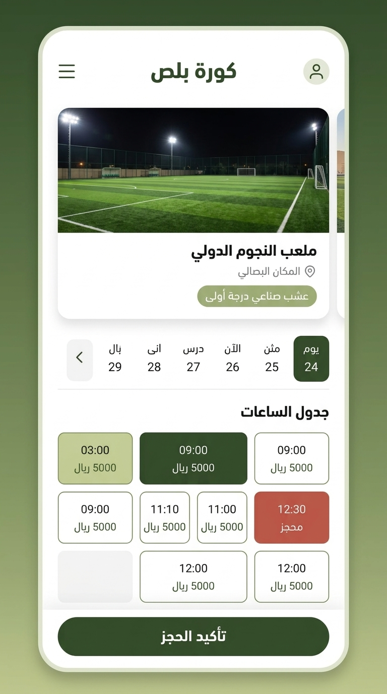

# نظام التصميم والهوية البصرية — كورة بلص (`KooraPlus`)
## Design System & UI Tokens

| الحقل | القيمة |
|---|---|
| **اسم المشروع** | منصة كورة بلص لحجز الملاعب الرياضية (KooraPlus Pitch Booking) |
| **الفريق** | SHIDRA TEAM (Team 01) |
| **المسؤول المعتمد** | أسامة الشميس (`OsamaShomis` — Team Coordinator) |
| **الحالة** | معتمد رسمياً ✅ (Approved) |
| **الإصدار** | 1.0 |
| **تاريخ الاعتماد** | 2026-09-26 |
| **الخطوة المرتبطة** | الخطوة 11 في [`docs/WORK_DISTRIBUTION.md`](file:///e:/level_4/Software%20Engineering/Practical/Lab%201/docs/WORK_DISTRIBUTION.md) |

---

## 1. فلسفة الهوية والطابع الرياضي (Brand Philosophy)

تستمد منصة **كورة بلص** هويتها البصرية من عشب الملاعب الحقيقي وروح المنافسة الرياضية الأصيلة تحت أضواء الكشافات:
- **الطابع العام:** رياضي، طبيعي، راقٍ، هادئ ومريح للعين، يبتعد عن الألوان الفاقعة المشتتة.
- **التجربة الرقمية:** تجربة هاتف أولاً (Mobile-First) فائقة السرعة، تتيح للاعب معرفة الساعات الشاغرة وحجز فترته خلال أقل من دقيقة.
- **دعم اللغة العربية:** واجهات مصممة بالكامل وفق نمط الاتجاه من اليمين إلى اليسار (RTL-First).

---

## 2. لوحة الألوان وتوكنز التصميم (Color Palette & Tokens)

تم اعتماد باليت الألوان الترابية والعشبية المتدرجة (Pitch Natural Olive Palette):

```
#354C2B ─── #4E653D ─── #697E50 ─── #859864 ─── #A4B17B ─── #C3CA92
 الغابي الداكن      الأساسي         المتوسط          الناعم         الميرمية        العشبي الفاتح
```

### أ. درجات الهوية الأساسية (Brand Palette Tokens)

| التوكن (Token) | الكود اللوني (HEX) | المعاينة | الدور المعماري في الواجهة |
|---|:---:|:---:|---|
| `--color-primary-dark` | `#354C2B` | <span style="background:#354C2B;padding:2px 14px;border-radius:4px;color:#fff;">#354C2B</span> | **الأخضر الغابي الداكن:** شعار المنصة، العناوين الكبرى H1/H2، شريط التنقل العلوي، وزر تأكيد الحجز الرئيسي |
| `--color-primary` | `#4E653D` | <span style="background:#4E653D;padding:2px 14px;border-radius:4px;color:#fff;">#4E653D</span> | **الأخضر العشبي الأساسي:** أسماء الملاعب، الروابط النشطة، العناوين الفرعية، وحالة التحويم للأزرار |
| `--color-primary-medium` | `#697E50` | <span style="background:#697E50;padding:2px 14px;border-radius:4px;color:#fff;">#697E50</span> | **الزيتوني المتوسط:** حدود البطاقات والأزرار الثانوية، شارات نوع الأرضية |
| `--color-accent-soft` | `#859864` | <span style="background:#859864;padding:2px 14px;border-radius:4px;color:#fff;">#859864</span> | **الزيتوني الناعم:** حدود خلايا الساعات المتاحة، الأيقونات التوضيحية، والنصوص المساعدة |
| `--color-surface-mint` | `#A4B17B` | <span style="background:#A4B17B;padding:2px 14px;border-radius:4px;color:#000;">#A4B17B</span> | **لون الميرمية:** خلفيات شارات الفترات المتاحة، والوسوم النشطة، والخطوط الفاصلة الرقيقة |
| `--color-surface-tint` | `#C3CA92` | <span style="background:#C3CA92;padding:2px 14px;border-radius:4px;color:#000;">#C3CA92</span> | **العشبي الفاتح الباستيل:** خلفية خانات الساعات النشطة، ومربعات التنبيه التفاعلية الناعمة |

---

### ب. الألوان الوظيفية لجدول الساعات والحالات (Slot States)

| حالة الفترة الزمنية | لون الخلفية | لون الحدود | لون النص والشارة | السلوك والتفاعل |
|---|---|---|---|---|
| **فترة متاحة للحجز (Available)** | `#FFFFFF` أو `#F8FAF6` | `#859864` (1.5px) | نص: `#354C2B`<br>شارة: `#A4B17B` | فترة شاغرة، تنبض بالحيوية وجاهزة للنقر |
| **فترة محددة لحظياً (Selected)** | `#C3CA92` أو `#354C2B` | `#354C2B` (2px) | نص: `#FFFFFF` (إذا كانت داكنة) | الفترة التي اختارها اللاعب وينتظر تأكيدها |
| **فترة محجوزة (Booked)** | `#FEF2F2` (أحمر ناعم) | `#FCA5A5` | نص: `#991B1B`<br>شارة: *"محجوز"* | مغلقة تماماً ومحمية من التضارب المتزامن |
| **فترة ماضية / معطلة (Past)** | `#F1F5F9` (رمادي) | `#E2E8F0` | نص: `#94A3B8` | ساعة انتهت في اليوم، معطلة وغير قابلة للنقر |

---

### ج. ألوان الأسطح والمحايدات (Surfaces & Neutrals)

- **خلفية المنصة الرئيسية (`--color-bg-main`):** `#F8FAF6` (أوف وايت دافئ مريح للعين).
- **خلفية البطاقات والحاويات (`--color-card-bg`):** `#FFFFFF` (أبيض ناصع مع تباين عالي).
- **نص العناوين الداكن (`--color-text-dark`):** `#1E291C` (داكن عميق مع لمحة زيتية).
- **نص الفقرات العادي (`--color-text-body`):** `#475569` (رمادي فحمي هادئ ومقروء).
- **حدود التقسيم (`--color-border-light`):** `#E2E8F0`.

---

## 3. الخطوط والتسلسل الطباعي (Typography)

- **الخط الأساسي للنصوص العربية:** **Cairo** أو **Tajawal** (من خطوط Google Fonts):
  - يتميز بوضوح هندسي عالي وتمايز واضح للأرقام العربية واللاتينية على شاشات الجوال.
- **خط الأرقام والساعات الإنجليزية:** **Inter** أو **Outfit**.

### سلم الأحجام الطباعية (Typographic Scale):

| المستوى | الحجم (Desktop) | الحجم (Mobile) | الوزن (Weight) | الاستخدام المعتمد |
|---|:---:|:---:|:---:|---|
| **H1 Display** | `32px` | `26px` | Bold (700) | العناوين الرئيسية، شعار المنصة، عنوان الصفحة |
| **H2 Section** | `24px` | `20px` | Bold (700) | اسم الملعب، عنوان جدول الساعات، لوحة التحكم |
| **H3 Card** | `18px` | `16px` | SemiBold (600) | أسماء الفترات، بطاقات الملاعب، ملخص الحجز |
| **Body Large** | `16px` | `15px` | Medium (500) | نصوص الأزرار، قيم الأسعار، تفاصيل الموقع |
| **Body Regular** | `15px` | `14px` | Regular (400) | الفقرات، الشروط وقواعد الإلغاء |
| **Caption / Tag** | `13px` | `12px` | Medium (500) | شارات نوع العشب، تنبيهات الساعات، الرموز |

---

## 4. القياسات، التباعد، والزوايا (Spacing & Radii)

- **نظام التباعد (8-Point Grid System):**
  - `4px`: التباعد بين الأيقونة والنص المرفق.
  - `8px`: الحشوة الداخلية للأزرار المدمجة وشارات الحالة.
  - `16px`: التباعد المعياري داخل البطاقات والحقول ونوافذ التأكيد.
  - `24px`: الفواصل بين الأقسام الرئيسية لصفحة الحجز.
  - `32px`: الهوامش الخارجية للصفحة على الشاشات الكبيرة.
- **زوايا التدوير (Border Radius):**
  - **الأزرار وحقول الإدخال:** `10px` (شكل عصري ناعم ومريح للمس).
  - **بطاقات الملاعب وخانات الفترات:** `14px` إلى `16px`.
  - **شارات الحالة (Badges):** `9999px` (كبسولة كاملة Pill).
- **أحجام مناطق اللمس (Touch Target):** لا يقل أي زر أو خلية فترة زمنية عن **`48px`** ارتفاعاً لضمان سهولة النقر بالإبهام على الهواتف.

---

## 5. مواصفات المكونات الأساسية (Core UI Components)

### 1. بطاقة الملعب (Pitch Card):
- صورة أفقية متناسقة بأبعاد `16:9` للملعب تحت الأضواء الكاشفة.
- شارة مميزة بلون `--color-surface-mint` (`#A4B17B`): *"عشب صناعي درجة أولى"*.
- عنوان الملعب، أيقونة الموقع (صنعاء - حدة)، وسعر الساعة البارز: `5,000 ريال / ساعة`.
- زر إجراء مباشر: *"عرض الساعات المتاحة"*.

### 2. خلية الفترة الزمنية (Time Slot Cell):
- تعرض وقت البداية والنهاية (مثلاً: `07:00 م - 08:00 م`).
- إظهار السعر المخصص للفترة مع شارة الحالة.
- تأثير تفاعلي خفيف (Lift on Hover) على الفترات المتاحة.

### 3. زر الإجراء الرئيسي (Primary CTA Button):
- الخلفية: `#354C2B` مع نص أبيض `#FFFFFF`.
- عرض كامل (Full Width) على شاشات الجوال لسهولة الضغط.
- حالة التعطيل (Disabled): في حال عدم اختيار ساعة أو كون الساعة محجوزة.

---

## 6. المعاينة المرئية للشاشات (Visual Mockup Preview)

تم إعداد وتضمين معاينة مرئية معتمدة توضح تطبيق باليت الألوان على شاشة حجز الفترات الزمنية في منصة كورة بلص:



*(الملف المصدري عالي الدقة محفوظ في المستودع بمسار: [`docs/assets/kooraplus_ui_preview.jpg`](file:///e:/level_4/Software%20Engineering/Practical/Lab%201/docs/assets/kooraplus_ui_preview.jpg))*.

---

## 7. سهولة الوصول ومعايير الجودة (Accessibility & Compliance)

- **نسبة التباين (Contrast Ratio):** جميع النصوص والعناوين تحقق معيار **WCAG 2.1 AA** (نسبة تباين تفوق 4.5:1 للنصوص العادية و 7:1 للنصوص الكبيرة أمام الخلفيات الفاتحة).
- **الاستغناء عن الألوان كدلالة وحيدة:** كل فترة زمنية لا تعتمد على اللون فقط بل تحتوي على تسمية نصية واضحة وشارة صريحة (*"متاح"* أو *"محجوز"*).
- **التفاعل الصوتي وتوافق قارئات الشاشة:** دعم وسوم ARIA الملائمة لخلايا جدول الساعات (`role="button"`, `aria-pressed`, `aria-label`).
