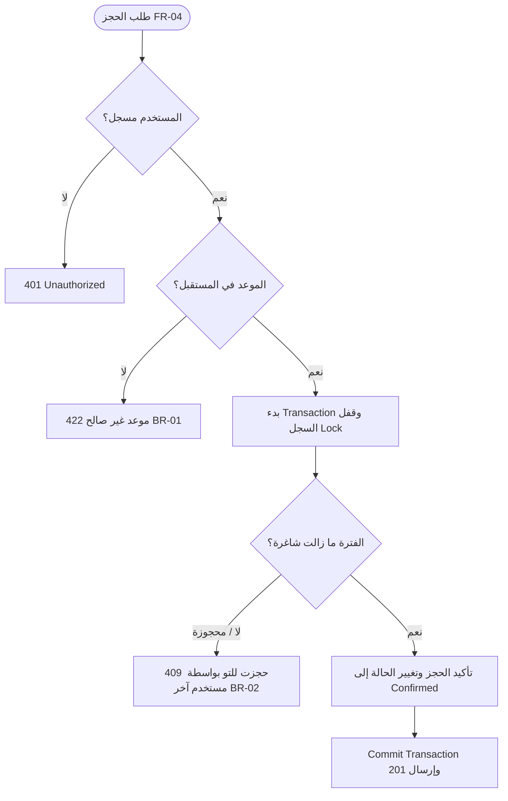

# ورقة عمل حالات الحافة والاستثناءات (Edge Cases Worksheet)
## منصة كورة بلص لحجز الملاعب الرياضية — KooraPlus
### وثيقة فحص حالات الحافة وضمان الجودة (`docs/EDGE_CASES_WORKSHEET.md`)

| الحقل | القيمة |
|---|---|
| **المشروع** | منصة كورة بلص لحجز الملاعب (KooraPlus) |
| **المسؤول المعتمد** | أسامة العقاب (`osalokab` — Quality Reviewer & Developer) |
| **المراجع المعتمد** | محمد الإدريسي (`Mo-ra778` — Repository Maintainer) |
| **الإصدار** | 1.0 (معتمد للنسخة الأولى) |
| **تاريخ التحديث** | 2026-09-26 |

---

## 1. جدول حالات الحافة المصنفة بحسب الفئات (Category-Based Matrix)

| الفئة | السؤال / السيناريو | الحالة المكتشفة (Edge Case) | السلوك المتوقع والمعالجة البرمجية | المتطلب المرتبط |
|---|---|---|---|:---:|
| **التزامن (Concurrency)** | ماذا لو ضغط لاعبان على حجز نفس الفترة في نفس الجزء من الثانية؟ | محاولة حجز متزامن لنفس الـ `time_slot_id` (Race Condition). | استخدام `DB::transaction` مع Pessimistic Lock (`lockForUpdate`). يقبل النظام طلب أحدهما (`201 Created`) ويرفض الآخر مع رسالة خطأ واضحة (`409 Conflict: هذه الفترة حُجزت للتو`). | **FR-04 / BR-02** |
| **الوقت (Time Rules)** | ماذا لو حاول المستخدم حجز فترة زمنية انتهت أو في يوم سابق؟ | إرسال تاريخ ماضٍ أو ساعة مضت في نفس اليوم. | التحقق عبر Validation Rule (`after:now`). يتم رفض الطلب (`422 Unprocessable Content`) وتعطيل الفترات السابقة في الواجهة. | **FR-03 / BR-01** |
| **الوقت (Time Rules)** | ماذا لو حاول اللاعب إلغاء الحجز قبل بدء المباراة بأقل من ساعتين (مثلاً قبل ساعة ونصف)؟ | محاولة إلغاء تخالف نافذة الإلغاء المسموحة. | فحص الفرق الزمني: إذا كان الوقت المتبقي < 2 ساعة، يرفض النظام الإلغاء مع إرجاع رسالة: *"لا يمكن إلغاء الحجز قبل أقل من ساعتين من الموعد"*. | **FR-06 / BR-03** |
| **الصلاحيات (Authorization)** | ماذا لو حاول صاحب ملعب استعراض أو تعديل حجوزات ملعب يخص مالكاً آخر؟ | تلاعب برقم المعرف `pitch_id` في الطلب (IDOR). | استخدام Laravel Policy أو Authorization Guard للتأكد من ملكية الملعب. في حال عدم الملكية، يُرجع النظام `403 Forbidden`. | **FR-05** |
| **الصلاحيات (Authorization)** | ماذا لو حاول لاعب غير مسجل إنشاء حجز؟ | إرسال طلب حجز بدون Token أو Session نشطة. | حماية مسار الحجز بـ `auth:sanctum`، وإعادة توجيه المستخدم لصفحة تسجيل الدخول (`401 Unauthorized`). | **FR-01 / FR-04** |
| **البيانات (Data Validation)** | ماذا لو تم إدخال بريد إلكتروني مكرر أو رقم هاتف بصيغة غير صحيحة عند التسجيل؟ | تكرار البيانات أو إدخال قيم خاطئة. | تفعيل Form Request Validation مع إرجاع رسائل خطأ دقيقة باللغة العربية بجانب الحقل دون إعادة تحميل الصفحة. | **FR-01** |
| **التكرار (Idempotency)** | ماذا لو نقر المستخدم زر "تأكيد الحجز" أو "إلغاء الحجز" مرتين متتاليتين بسرعة؟ | إرسال Double-Click Requests مكررة. | تعطيل زر التأكيد فور النقر برمجياً في الواجهة (`disabled state`)، والتحقق في الـ Backend من حالة السجل لمنع المعالجة المكررة. | **FR-04 / FR-06** |
| **الشبكة (Network / Failures)** | ماذا لو انقطع الاتصال أو فشلت قاعدة البيانات أثناء إنشاء سجل الحجز؟ | خطأ غير متوقع أثناء المعالجة (Partial Failure). | التراجع التلقائي عن العملية (`Rollback Transaction`)، وإرجاع رسالة خطأ عامة لطيفة للمستخدم دون تعليق السجل. | **FR-04 / NFR-04** |

---

## 2. مصفوفة التحقق والقبول (Edge Case Acceptance Criteria)

---

## 3. قواعد اعتماد حالات الحافة

لا تُعتمد أي حالة حافة إلا إذا استوفت المعايير التالية:
1. **الارتباط الوثيق بنطاق المشروع:** ترتبط بأحد المتطلبات الوظيفية (`FR-01` إلى `FR-06`) أو قواعد العمل (`BR-01` إلى `BR-03`).
2. **إمكانية الحدوث الواقعية:** سيناريو واقعي في بيئة الاستخدام الفعلي.
3. **وجود معيار قبول واختبار مؤتمت:** تغطية الحالة باختبار Unit أو Feature داخل مجلد `tests/`.
4. **التوثيق في سجل الذكاء الاصطناعي:** تسجيل الفحص والمراجعة في [`AI_Log.md`](file:///d:/my_projects/koora+/AI_Log.md).
