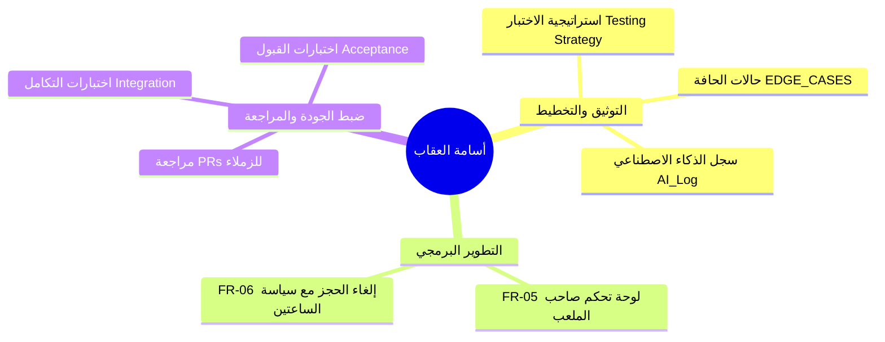

# وثيقة مهام ومسؤوليات أسامة العقاب (Role & Responsibilities)
## منصة كورة بلص — KooraPlus Pitch Booking Platform
### فريق شيدرا — SHIDRA TEAM (Team 01)

---

## 1. بطاقة التعريف بالدور (Profile & Role Card)

| الحقل | التفاصيل |
|---|---|
| **الاسم** | أسامة العقاب |
| **الدور الأساسي** | Developer & Quality Reviewer (مطوّر ومراجع الجودة) |
| **حساب GitHub** | [`osalokab`](https://github.com/osalokab) |
| **الفريق** | SHIDRA TEAM (Team 01) |
| **المشروع** | منصة كورة بلص لحجز الملاعب الرياضية (KooraPlus) |
| **المرجع الرئيسي** | [`docs/TEAM_ROLES.md`](file:///d:/my_projects/koora+/docs/TEAM_ROLES.md) و [`docs/WORK_DISTRIBUTION.md`](file:///d:/my_projects/koora+/docs/WORK_DISTRIBUTION.md) |

---

## 2. تفصيل المهام والمسؤوليات (Responsibilities Breakdown)

---

### 🟢 أولاً: مرحلة التخطيط والتوثيق (Planning & Documentation Phase)

1. **استراتيجية الاختبار الشاملة (`docs/Testing.md`):**
   - تحديد وتوثيق أنواع الاختبارات (Unit Testing, Feature Testing, Concurrency Testing, E2E Testing).
   - توثيق أدوات وآليات تنفيذ الاختبارات (مثل PHPUnit / Pest / Laravel Test Suite).
2. **حالات الحافة والاستثناءات (`docs/EDGE_CASES_WORKSHEET.md`):**
   - حصر وتوثيق الحالات الاستثنائية وكيفية معالجتها برمجياً (مثل تعارض الحجوزات المتزامنة، الإلغاء المتأخر، أخطاء الإدخال).
3. **حوكمة وتوثيق الذكاء الاصطناعي (`AI_Log.md`):**
   - إدارة سجل استخدام أدوات الذكاء الاصطناعي وتوثيق المطالبات والتحقق البشري من صحة المخرجات البرمجية والتوثيقية.

---

### 🔵 ثانياً: مرحلة التطوير البرمجي (Development Phase)

المسؤول عن تطوير وبناء الميزات الوظيفية التالية بشكل كامل مع كتابة الاختبارات الخاصة بها:

| رمز المتطلب | الميزة الوظيفية | الوصف | الفرع المخصص (Branch) |
|:---:|---|---|---|
| **FR-05** | **لوحة تحكم صاحب الملعب (Pitch Owner Dashboard)** | بناء واجهة واستعلامات استعراض جدول الحجوزات اليومية وإدارة الملاعب لأصحابها. | `feature/owner-dashboard` |
| **FR-06** | **إلغاء الحجز (Reservation Cancellation)** | تنفيذ منطق إلغاء الحجز للاعب مع التحقق الصارم من قاعدة العمل `BR-03` (الإلغاء متاح قبل ساعتين على الأقل من موعد الحجز). | `feature/cancellation` |

---

### 🟣 ثالثاً: مرحلة ضبط الجودة والمراجعة (Quality Assurance & Code Review)

1. **مراجعة الأكواد (Code Review):**
   - المراجع المعتمد لطلبات السحب (Pull Requests) الخاصة بـ **أسامة الشميس** (`OsamaShomis` — FR-01 و FR-02).
   - كتابة تعليقات مراجعة بناءة (Review Comments) والتأكد من مطابقة معايير الكود ونظافته.
2. **اختبارات التكامل والنظام (Integration & Acceptance Testing):**
   - فحص ترابط الميزات بعد دمجها للتأكد من عدم حدوث Regression.
   - التحقق النهائي من تلبية المتطلبات المحددة في وثيقة [`docs/SRS.md`](file:///d:/my_projects/koora+/docs/SRS.md).

---

## 3. مصفوفة الفروع والمراجعات (Git & Branching Workflow)

| المهمة | اسم الفرع (Branch) | الـ PR | المراجع المسؤول عنه (Reviewer) |
|---|---|:---:|---|
| توثيق خطة الاختبارات | `docs/testing-strategy` | PR | محمد الإدريسي (`Mo-ra778`) |
| سجل الذكاء الاصطناعي | `docs/ai-log` | PR | أسامة الشميس (`OsamaShomis`) |
| ميزة لوحة صاحب الملعب (FR-05) | `feature/owner-dashboard` | PR | محمد الإدريسي (`Mo-ra778`) |
| ميزة إلغاء الحجز (FR-06) | `feature/cancellation` | PR | محمد الإدريسي (`Mo-ra778`) |

---

## 4. قواعد الحوكمة وحدود العمل (Governance & Rules)

> [!IMPORTANT]
> **قواعد منع التعارض والمسؤوليات المحددة:**
> 1. **العمل داخل الفروع المخصصة فقط:** الالتزام بتطوير الميزات الموكلة (`FR-05`, `FR-06`) وتوثيق الاختبارات دون التعديل على فروع الزملاء.
> 2. **عدم التعديل المباشر على `main`:** جميع المساهمات ترفع عبر Pull Request.
> 3. **فصل المراجعة عن الكتابة:** المراجع لـ PRs أسامة العقاب هو **محمد الإدريسي** (`Mo-ra778`)، ولا يجوز اعتماد الـ PR ذاتياً.
> 4. **الدمج:** عملية الدمج إلى `main` تقع تحت صلاحية Repository Maintainer فقط.

---

## 5. قائمة التحقق للإنجاز (Definition of Done Checklist)

- [ ] إعداد خطة واستراتيجية الاختبارات في [`docs/Testing.md`](file:///d:/my_projects/koora+/docs/Testing.md).
- [ ] تحديث حالات الحافة في [`docs/EDGE_CASES_WORKSHEET.md`](file:///d:/my_projects/koora+/docs/EDGE_CASES_WORKSHEET.md).
- [ ] توثيق نشاطات الذكاء الاصطناعي في [`AI_Log.md`](file:///d:/my_projects/koora+/AI_Log.md).
- [ ] بناء ميزة لوحة صاحب الملعب (`FR-05`) واختبارها محلياً.
- [ ] بناء ميزة إلغاء الحجز مع شرط الساعتين (`FR-06`) واختبارها محلياً.
- [ ] مراجعة وتقديم الملاحظات على الـ PRs الموكلة إليه وكتابة Review Comments.
- [ ] إجراء اختبارات التكامل والتأكد من نجاح جميع الاختبارات (`php artisan test`).
