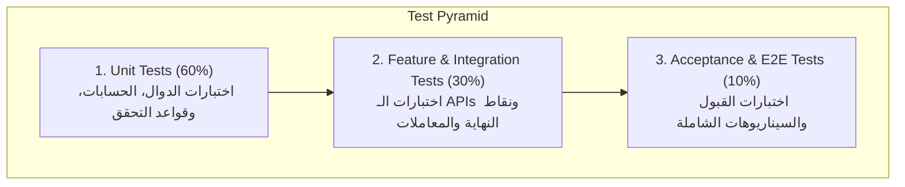

# استراتيجية الاختبار وضمان الجودة (Testing Strategy & QA)
## منصة كورة بلص لحجز الملاعب الرياضية — KooraPlus
### وثيقة استراتيجية الاختبار الشاملة (`docs/Testing.md`)

---

## 1. بطاقة الوثيقة ومعلومات الإشراف

| الحقل | القيمة |
|---|---|
| **اسم المشروع** | منصة كورة بلص لحجز الملاعب الرياضية (KooraPlus Pitch Booking) |
| **المسؤول المعتمد** | أسامة العقاب (`osalokab` — Developer & Quality Reviewer) |
| **المراجع المعتمد** | محمد الإدريسي (`Mo-ra778` — Repository Maintainer) |
| **الإصدار** | 1.0 (معتمد للنسخة الأولى) |
| **تاريخ التحديث** | 2026-09-26 |
| **المرجع** | [`docs/SRS.md`](file:///d:/my_projects/koora+/docs/SRS.md)، [`docs/WORK_DISTRIBUTION.md`](file:///d:/my_projects/koora+/docs/WORK_DISTRIBUTION.md) (الخطوة 14) |

---

## 2. أهداف استراتيجية الاختبار (Testing Objectives)

1. **التحقق من صحة المتطلبات الوظيفية (`FR-01` إلى `FR-06`):** التأكد من أن كل متطلب وظيفي يعمل بدقة وفقاً لمعايير القبول المحددة في الـ SRS.
2. **التحقق الصارم من قواعد العمل (Business Rules Enforcement):**
   - منع حجز المواعيد في الماضي (`BR-01`).
   - منع الحجز المزدوج والتعامل مع التزامن اللحظي (`BR-02` / Concurrency Race Conditions).
   - التحقق من شرط الإلغاء قبل ساعتين على الأقل من موعد المباراة (`BR-03`).
3. **ضمان استقرار النظام ومنع الانحدار (Regression Prevention):** ضمان عدم تأثر الميزات القائمة عند دمج ميزات جديدة عبر خط أنابيب CI/CD.
4. **التحقق من الأمان وتكامل البيانات (Security & Data Integrity):** حماية الـ Endpoints والتحقق من الصلاحيات وسلامة العمليات داخل Database Transactions.

---

## 3. هرم مستويات الاختبار (Test Pyramid & Levels)



---

## 4. تفصيل مستويات الاختبار (Test Levels Detail)

### 🟢 المستوى الأول: اختبارات الوحدات (Unit Testing)
- **النطاق:** فحص أصغر وحدات الكود المنطقية بشكل معزول (Models, Helpers, Custom Rules, Value Objects).
- **أهم الحالات المغطاة:**
  - التحقق من حساب أوقات الفترات وصيغ التواريخ.
  - التحقق من صحة دالة حساب الفرق الزمني بين وقت الإلغاء ووقت بدء الحجز (قاعدة `BR-03`).
  - فحص دوال التحقق من صحة المدخلات (Password Validation, Phone Format, Slot Availability Helper).

### 🔵 المستوى الثاني: اختبارات الميزات والتكامل (Feature & Integration Testing)
- **النطاق:** فحص استجابات الـ HTTP Controllers، قواعد البيانات (SQLite In-Memory/File)، والصلاحيات والـ Middleware.
- **أهم الحالات المغطاة:**
  - تدفق تسجيل الدخول والمصادقة (`FR-01`).
  - جلب قائمة الملاعب وفلترة الساعات المتاحة لتاريخ محدد (`FR-02`, `FR-03`).
  - إنشاء الحجز والتحقق من استخدام `DB::transaction` وقفل السجل لمنع الـ Race Condition (`FR-04`).
  - لوحة تحكم صاحب الملعب والتحقق من الصلاحية بحيث لا يرى إلا حجوزات ملاعبه (`FR-05`).
  - إلغاء الحجز والتحقق من استرجاع حالة الفترة لتصبح متاحة (`FR-06`).

### 🟣 المستوى الثالث: اختبارات التزامن والحمل (Concurrency & Race Condition Testing)
- **النطاق:** اختبار محاكاة طلبين متزامنين في نفس الجزء من الثانية لحجز نفس الـ Slot.
- **السلوك الإلزامي:**
  - يقبل النظام طلباً واحداً فقط بنجاح (`HTTP 201 Created`).
  - يرفض الطلب الثاني بخطأ صريح (`HTTP 409 Conflict` أو `HTTP 422`) مع رسالة واضحة دون تلف البيانات.

---

## 5. مصفوفة تتبع المتطلبات لحالات الاختبار (Test Traceability Matrix)

| رمز المتطلب | الميزة الوظيفية | نوع الاختبار | ملف الاختبار المقترح | معيار النجاح (Expected Result) |
|:---:|---|:---:|---|---|
| **FR-01** | المصادقة وتسجيل الدخول | Feature | `tests/Feature/AuthTest.php` | تسجيل دخول صحيح يُرجع Token، وبيانات خاطئة تُرجع `401 Unauthorized`. |
| **FR-02** | تصفح الملاعب | Feature | `tests/Feature/PitchCatalogTest.php` | إرجاع قائمة الملاعب النشطة مع الأسعار والصور ونوع الأرضية. |
| **FR-03** | استعراض الساعات المتاحة | Feature / Unit | `tests/Feature/TimeSlotTest.php` | الساعات المتاحة تظهر شاغرة، والمحجوزة تظهر غير قابلة للاختيار. |
| **FR-04** | حجز فترة زمنية وتأكيدها | Feature & Concurrency | `tests/Feature/BookingTest.php` | إنشاء سجل حجز بنجاح، ومنع الحجز المزدوج (`Locking`). |
| **FR-05** | لوحة تحكم صاحب الملعب | Feature | `tests/Feature/OwnerDashboardTest.php` | صاحب الملعب فقط يرى جدول حجوزات ملعبه، واللاعب العادي يُمنع (`403 Forbidden`). |
| **FR-06** | إلغاء الحجز | Feature & Unit | `tests/Feature/CancellationTest.php` | نجاح الإلغاء إذا تبقى أكثر من ساعتين، والرفض مع رسالة إذا تبقى أقل من ساعتين. |

---

## 6. الأدوات وبيئة التنفيذ (Tools & Environment)

| الأداة | الغرض |
|---|---|
| **PHPUnit / Pest** | إطار عمل تنفيذ اختبارات Laravel الآلية. |
| **Database Transactions / RefreshDatabase** | إعادة ضبط قاعدة بيانات الاختبار بعد كل فحص لضمان العزل التام. |
| **SQLite In-Memory (`:memory:`)** | قاعدة بيانات سريعة لتشغيل الاختبارات محلياً وعبر CI. |

---

## 7. تعليمات تشغيل الاختبارات محلياً

```bash
# تشغيل جميع الاختبارات
php artisan test

# تشغيل اختبار محدد لميزة الحجز
php artisan test --filter BookingTest

# تشغيل اختبارات ميزة الإلغاء
php artisan test --filter CancellationTest
```

---

## 8. معايير قبول الجودة (Definition of Done for QA)
1. **جميع الاختبارات تجتاز بنجاح 100% (`All Tests Passing`).**
2. **تغطية شاملة للمسار الإيجابي (Happy Path) والمسار السلبي (Negative Cases) لكل Feature.**
3. **التحقق من جميع حالات الحافة الموثقة في [`docs/EDGE_CASES_WORKSHEET.md`](file:///d:/my_projects/koora+/docs/EDGE_CASES_WORKSHEET.md).**
