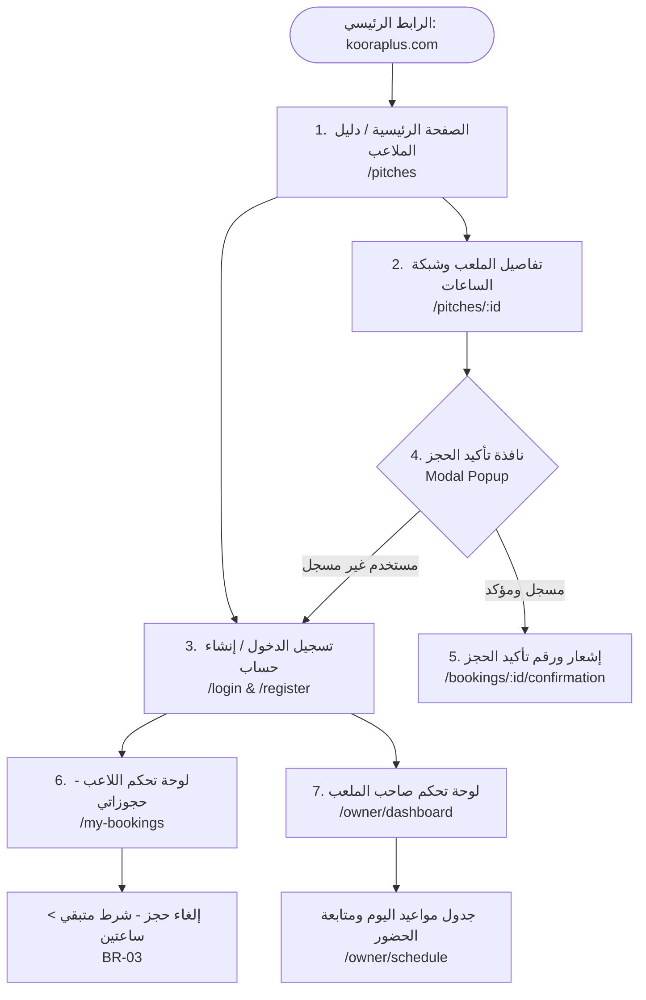

# هيكلية شاشات الواجهة وخريطة التنقل — كورة بلص (`KooraPlus`)
## UI Structure, Pages Map & Responsive Navigation

| الحقل | القيمة |
|---|---|
| **اسم المشروع** | منصة كورة بلص لحجز الملاعب الرياضية (KooraPlus Pitch Booking) |
| **الفريق** | SHIDRA TEAM (Team 01) |
| **المسؤول المعتمد** | أسامة الشميس (`OsamaShomis` — Team Coordinator) |
| **الحالة** | معتمد رسمياً ✅ (Approved) |
| **الإصدار** | 1.0 |
| **تاريخ الاعتماد** | 2026-09-26 |
| **الخطوة المرتبطة** | الخطوة 12 في [`docs/WORK_DISTRIBUTION.md`](file:///e:/level_4/Software%20Engineering/Practical/Lab%201/docs/WORK_DISTRIBUTION.md) |

---

## 1. نظرة عامة ومعمارية الواجهة المتجاوبة (Overview & Responsive Web Concept)

تم تصميم منصة **كورة بلص** كـ **منصة ويب متجاوبة وشاملة (Cross-Platform Responsive Web Application)** تعمل بسلاسة فائقة عبر متصفحات الهواتف الذكية (iOS / Android) وأجهزة الحواسيب المكتبية واللابتوب (Windows / Mac):
- **تجربة الجوال (Mobile-First):** تبدو كـ تطبيق أصيل، بأزرار لمس واسعة (ارتفاع 48px فما فوق) وشبكة ساعات مدمجة تلائم التصفح السريع بيد واحدة.
- **تجربة المتصفح المكتبي (Desktop View):** واجهات عريضة متعددة الأعمدة لعرض الملاعب وجداول مواعيد اليوم الممتدة لصاحب الملعب.
- **التوافق مع نظام التصميم:** الالتزام الصارم بباليت الألوان العشبية المعتمدة في [`docs/Design-System.md`](file:///e:/level_4/Software%20Engineering/Practical/Lab%201/docs/Design-System.md).

---

## 2. خريطة الموقع وهرمية الشاشات (Site Map & Navigation Diagram)

---

## 3. التوصيف التفصيلي للشاشات ومكوناتها (Screen Specifications)

### شاشة 1: الصفحة الرئيسية ودليل الملاعب (`/pitches`)
- **شريط التنقل العلوي (Global Navbar):**
  - شعار منصة **كورة بلص** بالأخضر الغابي الداكن (`#354C2B`).
  - روابط التنقل السريعة (الملاعب، العروض، الشروط).
  - زر تسجيل الدخول أو القائمة الشخصية في حال تسجيل الدخول.
- **شريط البحث والتصفية السريعة (Search & Filter Bar):**
  - حقل بحث فوري بالاسم أو المنطقة (مثل: حدة، السبعين، شميلة).
  - قائمة منسدلة لنوع الأرضية: (الكل، عشب صناعي، عشب طبيعي، صالة مغلقة).
  - شريط تحديد نطاق السعر بالساعة (بالريال اليمني).
- **شبكة بطاقات الملاعب (Pitches Catalog Grid):**
  - بطاقة لكل ملعب (`Pitch Card`) تشمل:
    - صورة أفقية احترافية للملعب (16:9).
    - اسم الملعب وشارة نوع العشب (`#A4B17B`).
    - المسافة والموقع الجغرافي.
    - السعر بالساعة بخط عريض وواضح (`5000 ريال / ساعة`).
    - زر إجراء مباشر: *"عرض الساعات المتاحة"*.

---

### شاشة 2: تفاصيل الملعب وشبكة الساعات (`/pitches/{id}`)
- **معلومات الملعب والمرافق (Pitch Details Header):**
  - معرض صور متعددة للملعب.
  - قائمة الخدمات والمرافق المتوفرة: (كشافات إنارة ليلية، مياه شرب مجانية، مواقف سيارات، غرف تبديل ملابس).
- **منتقي التاريخ التفاعلي (Horizontal Date Picker):**
  - شريط أفقي قابل للسحب يعرض تواريخ الأيام: (اليوم، غداً، الأيام التالية مع اسم اليوم والتاريخ).
- **شبكة الساعات التفاعلية (Time Slots Grid):**
  - مقسمة لفترات صباحية ومسائية.
  - **ساعة متاحة:** خلفية بيضاء، حدود زيتونية ناعمة (`#859864`) وسعر الساعة.
  - **ساعة محددة:** تبرز فوراً بخلفية الأخضر الغابي الداكن (`#354C2B`) أو العشبي الفاتح (`#C3CA92`) مع علامة اختيار ✓.
  - **ساعة محجوزة:** خلفية حمراء هادئة (`#FEF2F2`) وشارة نصية بارزة *"محجوز"* مع تعطيل إمكانية النقر.
- **شريط الحجز العائم (Sticky Bottom Booking Bar):**
  - مثبت أسفل الشاشة على الهواتف، يظهر الساعة المحددة وإجمالي السعر، وزر *"تأكيد الحجز"* العريض.

---

### شاشة 3: نافذة تأكيد الحجز المنبثقة (Booking Confirmation Modal)
- نافذة تظهر فور الضغط على زر الحجز وتتضمن:
  - تفاصيل الملعب المحجوز وتاريخ ووقت الفترة المختارة.
  - تنبيه طريقة الدفع: *"الدفع يتم نقداً كاش في مقر الملعب عند الحضور"* (توافقاً مع نطاق MVP).
  - تنبيه سياسة الإلغاء: *"يمكنك إلغاء الحجز مجاناً حتى موعد أقصاه ساعتان قبل بداية المباراة"* (تطبيقاً لـ `BR-03`).
  - زران: *"تثبيت وتأكيد الحجز"* (بالأخضر الغابي)، و *"تراجع / تغيير الموعد"*.

---

### شاشة 4: شاشة حجوزاتي للاعب (`/my-bookings`)
- **تبويب الحجوزات القادمة (Upcoming Bookings):**
  - بطاقة الحجز: كود الحجز المرجعي، اسم الملعب، التاريخ، الساعة، وحالة الحجز: `[مؤكد]`.
  - زر *"إلغاء الحجز"*: 
    - مفعّل بالأحمر إذا كان الوقت المتبقي أكثر من 120 دقيقة.
    - معطّل تلقائياً مع تنبيه توضيحي إذا تبقى أقل من ساعتين.
- **تبويب الحجوزات السابقة (Past Bookings History):**
  - أرشيف المباريات المنتهية والملغاة لمتابعة السجل الرياضي للاعب.

---

### شاشة 5: لوحة تحكم صاحب الملعب (`/owner/dashboard`)
- **بطاقات الإحصائيات السريعة:** إجمالي حجوزات اليوم، الساعات الشاغرة المتبقية، وساعات الذروة.
- **جدول الساعات الحي لليوم (Live Daily Schedule):**
  - جدول تفصيلي زمني يعرض كل ساعة من الصباح حتى منتصف الليل.
  - لكل ساعة محجوزة: يظهر اسم اللاعب، رقم الهاتف، وزر *"تأكيد الحضور"* أو *"إلغاء الحجز"*.
  - لكل ساعة شاغرة: زر *"حجز يدوي مباشر"* للزبائن العابرين في مقر الملعب.

---

### شاشة 6: الدخول والتسجيل (`/login` & `/register`)
- حقول نظيفة وسريعة: (الاسم، رقم الهاتف أو البريد، وكلمة المرور).
- في شاشة التسجيل: مفتاح اختيار نوع الحساب: `[ لاعب / كابتن فريق ]` أو `[ صاحب / مسؤول ملعب ]`.

---

## 4. مقارنة وتكيف التصميم بين الجوال والحاسوب (Responsive Breakdown)

| المكون / الشاشة | على متصفح الهواتف المحمولة (Mobile View) | على المتصفح المكتبي واللابتوب (Desktop View) |
|---|---|---|
| **قائمة الملاعب** | بطاقات عمودية متتالية بعمود واحد لسهولة التمرير بالإبهام | شبكة من 3 أو 4 أعمدة متناسقة (3-Column Grid) |
| **فلاتر البحث** | زر فلترة منبثق يفتح قائمة فلاتر سفلية (Bottom Sheet) | شريط جانبي ثابت على يمين الصفحة (Sidebar Filter) |
| **شاشة تفاصيل الملعب** | عرض رأسي متتابع (الصور ثم المواصفات ثم شبكة الساعات) | تقسيم الشاشة لعمودين (معلومات الملعب يميناً، وشبكة الساعات والحجز يساراً) |
| **شريط الحجز** | شريط عائم مثبت بأسفل شاشة الهاتف لسهولة النقر | صندوق تأكيد ثابت في العمود الأيسر (Fixed Booking Card) |
| **لوحة تحكم المسؤول** | بطاقات رأسية لكل ساعة مع أزرار لمس كبيرة | جدول زمني تفاعلي أفقي عريض (Timeline Schedule) |

---

## 5. حالات الشاشات الاستثنائية والتنبيهات (Edge States)

1. **حالة البحث الفارغ (Empty Search):**  
   ظهور رسالة لطيفة: *"لا توجد ملاعب تطابق خيارات البحث في هذه المنطقة"* مع زر لإعادة ضبط الفلاتر.
2. **حالة غياب الحجوزات القادمة (No Bookings):**  
   في شاشة حجوزاتي: *"لا توجد لديك حجوزات قادمة.. استعرض الملاعب المتاحة واحجز مباراتك الآن"*.
3. **تنبيه التعارض المتزامن (Race Condition Alert):**  
   في حال حجز شخصان نفس الساعة في نفس اللحظة: ظهور تنبيه فوري باللون الأحمر: *"عذراً، تم حجز هذه الفترة للتو من قِبل مستخدم آخر.. يُرجى اختيار فترة أخرى"* مع تحديث حالة الساعة إلى محجوزة فوراً دون إعادة تحميل الصفحة.
4. **محاولة الإلغاء المتأخر (Late Cancellation Error):**  
   رسالة تنبيهية عند محاولة الإلغاء: *"لا يمكن إلغاء الحجز قبل أقل من ساعتين على موعد المباراة وفقاً لسياسة المنصة"*.

---

## 6. الربط المعماري مع مهام الـ Backend (Traceability to Architecture)

يوفر هذا التوصيف خريطة طريق مباشرة لزميلنا **محمد الإدريسي (`Mo-ra778`)** لإعداد ملفات المعمارية والـ APIs وقاعدة البيانات:
- **Controllers المطلوبة:** `PitchController`, `BookingController`, `AuthController`, `OwnerDashboardController`.
- **API Endpoints المرتبطة:**
  - `GET /api/pitches`: تغذية شاشة الملاعب.
  - `GET /api/pitches/{id}/slots?date=YYYY-MM-DD`: تغذية شبكة الساعات.
  - `POST /api/bookings`: استقبال طلب الحجز من نافذة التأكيد.
  - `DELETE /api/bookings/{id}`: تنفيذ أمر الإلغاء من شاشة حجوزاتي.
- **جداول قاعدة البيانات المقابلة:** `users`, `pitches`, `time_slots`, `bookings`.
