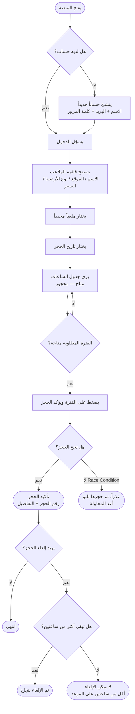
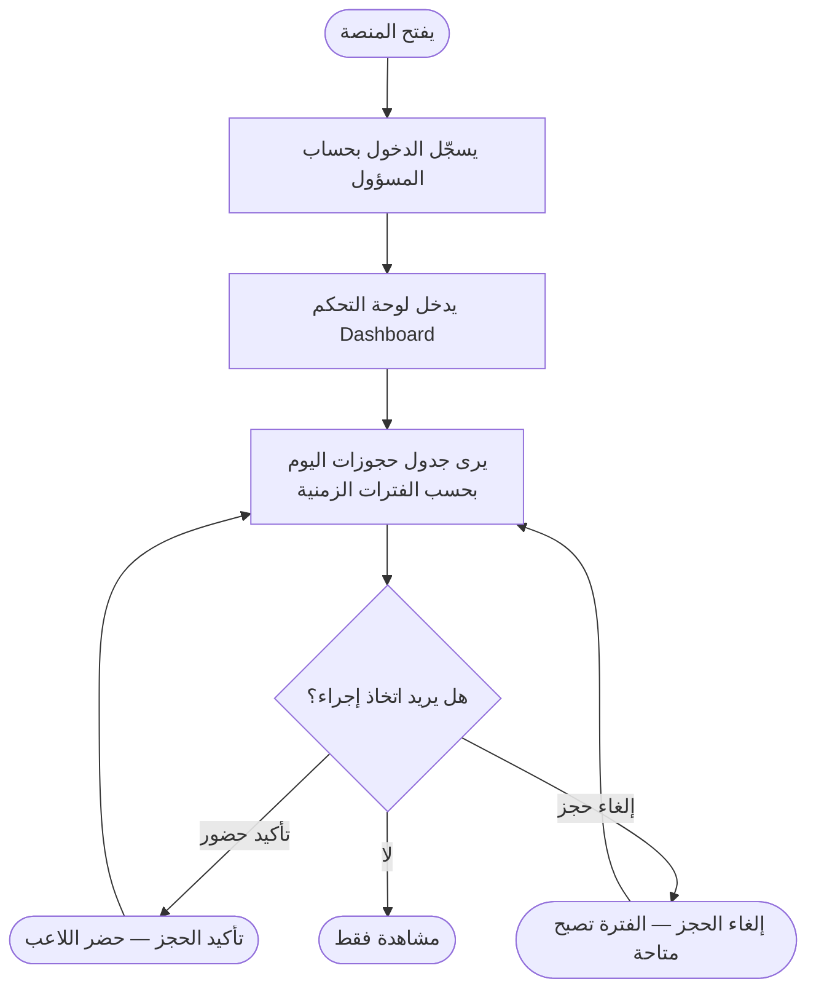
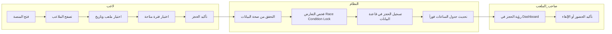

# User Flow & Business Flow
## تدفقات المستخدم والعمليات التجارية — منصة كورة بلص (KooraPlus)

| الحقل | القيمة |
|---|---|
| اسم المشروع | KooraPlus Pitch Booking |
| الفريق | SHIDRA TEAM (Team 01) |
| الإصدار | 1.0 |
| آخر تحديث | 2026-09-26 |

---

## 1. تدفق اللاعب / كابتن الفريق (Player Flow)

---

## 2. تدفق صاحب الملعب / المسؤول (Venue Owner Flow)

---

## 3. Business Flow — تدفق العملية الكاملة من البداية للنهاية

---

## 4. حالات الحافة في التدفق (Edge Cases in Flow)

| الحالة | سلوك النظام |
|---|---|
| **لاعب غير مسجّل يحاول الحجز** | يُعاد توجيهه لصفحة تسجيل الدخول تلقائياً |
| **فترة محجوزة للتو (Race Condition)** | رسالة خطأ فورية، الفترة تُحذف من الاختيار |
| **محاولة حجز في تاريخ/وقت مضى** | الأزرار معطّلة، لا يمكن الاختيار |
| **إلغاء متأخر (أقل من ساعتين)** | رفض الإلغاء مع توضيح سبب الرفض |
| **انقطاع الإنترنت أثناء الحجز** | لا يُسجَّل حجز معلق، تنبيه بإعادة المحاولة |
